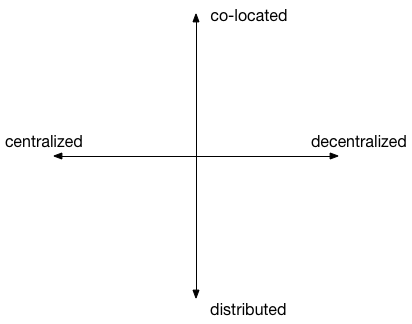

# Types of Distributed Architectures

Distributed architectures comprise a system of processors of some sort that are interconnected to achieve some purpose. 

- Where is the processing done?
- How are the processors and other devices interconnected?
- Are they always connected the same way or does the connectivity change over time?
- What types of communication is used between nodes (e.g. RPC, Request-Response, Event, message, synchronous, asynchronous)
- Where is the information stored?
- What rules or standards are used?

## Hierarchy vs Heterarchy

Heterarchy depends on

1. Collapse of functions. No hardwired distinctions in nodes

2. Freedom and ability to bypass. 

3. Decentralized and distributed resources

## Pipeline and Tree

Multiprocessor architectures

- Systolic
- MapReduce

Data centric

## Client Server

Processes have roles, either client or server

Layered applictions

- 2-tier
- N-tier and middleware
- Thin vs Thick client

Servers as clients

Vertically distributed

## Peer to Peer

No distinction between servers and clients. 

- Distributed objects (can be tightly (EJB) or loosely (pico) clustered)
- Event-bus
- Internet
- Overlay networks (SMTP, Web)

Horizontally distributed
