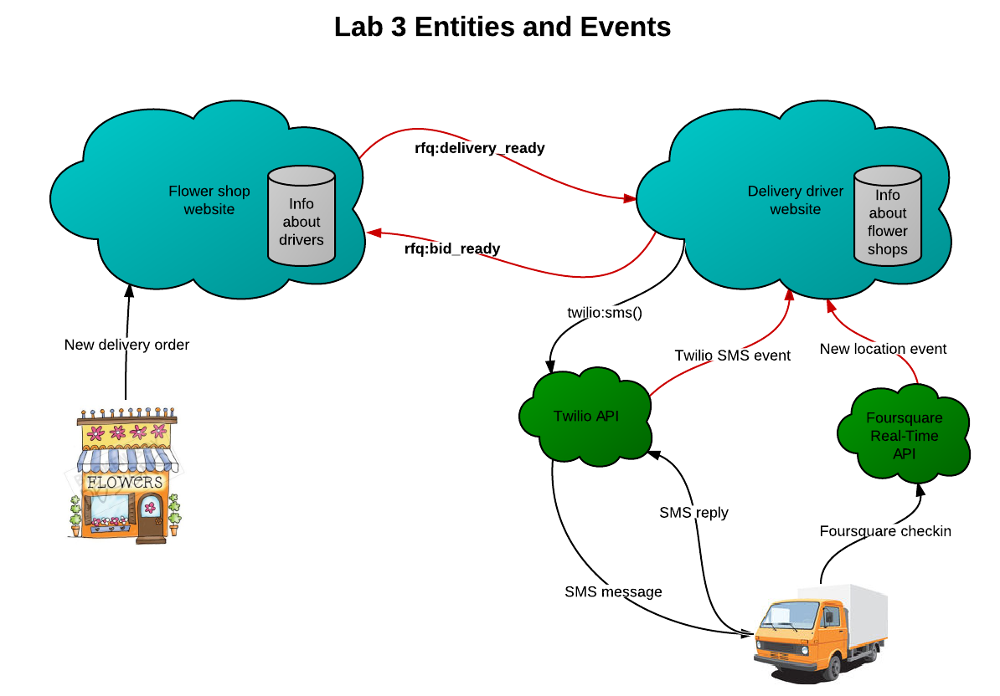

# Lab 3: Consuming and Processing Events

**Objective:** Understand the concepts of event consumption, event signal URLs (ESLs), and subscription. Use APIs from Foursquare and Twilio.

Review the [Evented API specification](http://www.eventedapi.org/spec). You will be implementing an event consumer in this lab. The event consumer will need to provide ESLs for the flower shop.

The flower shop and delivery driver will play both consumer and generator roles in this lab in order to effect a negotiation about whether or not the driver will deliver the flowers.

This is a diagram of the entities and events in this system:

# Delivery driver 

Build a website to represent delivery drivers.

- The site will receive three kinds of events
  - Foursquare checkins (similar to what you did in Lab 1)
  - **rfq:delivery_ready** events from the flower shops
  - Twilio SMS message notifications 
- The site must support the creation of multiple, unique Event Signal URLs (ESLs) for each flower shop for whom the driver wants to deliver 
- The ESLs represent a channel by which the flower shop will send events to the driver 
- The website must be able to identify a flower shop by ESL 
- For each flower shop, you will need to know and store the following:
  - name
  - location (lat-long coordinates), for calculating distance from driver location
  - the flower shop's ESL, for sending events back

## Listening for events 

The Website should 

- Include an event consumer to listen for and process Foursquare "events"
  - Store lat-long information about the last checkin for use in determining response to an **rfq:delivery_ready** event.
- Include an event consumer to listen for **rfq:delivery_ready** events as follows:
  - If the driver is within _n_ miles of the flower shop, submit a bid automatically to the flower shop and send the driver an SMS notification about the details of the bid.
  - If the bid can't be processed automatically, send the driver an SMS. If the driver responds to the SMS with "bid anyway", submit a bid to the flower shop.
- Include an event consumer to listen for Twilio SMS notifications, as explained above

## Signaling events

You will be signaling one event in this lab. The event domain and name must be the following:

- Event domain: **rfq**
- Event name: **bid_available**

That event will need several attributes, such as the following:

- Driver name
- Estimated delivery time

When the delivery driver site receives an **rfq:delivery_ready** event, it

- Runs the algorithm given above to determine whether or not to respond
- If a response is needed, signals a **rfq:bid_available** event to the flower shop's ESL.

# Flower shop

Modify your flower shop website to

- Add and track a unique identifier for each **rfq:deliver_ready** event. The identifier should be included as an attribute when the event is signaled
- Support the creation of multiple unique ESLs that can be given to the drivers
- Listen for **rfq:bid_available** events
- Process **rfq:bid_available** events by posting them to a Web form. The form should
  - Show relevant information (the driver name and estimated delivery time).
  - Include a means for the flower shop owner to select one of the bids. 
  - Separate different **bid_available** events based on their corresponding **rfq:delivery_ready** events (hint: use the identifier discussed above).

# Implementation Notes

- There can be multiple flower shops and multiple drivers. Your system should respond not only to events from your flower shop and drivers, but should be able to connect shops or drivers from other student's implementations. This requires that you follow the Evented API specification carefully and use standard event domains and types.
- You will use the **Foursquare Real-Time API** to receive the driver's location updates. Some of your code from Lab 1 (especially OAuth) will be necesary to do this. A few things to keep in mind:
  - The API is documented [here](https://developer.foursquare.com/overview/realtime)
  - Your system must support SSL.
  - You will give Foursquare a URL to your server, which acts as the event consumer for Foursquare.
  - This consumer will receive the driver's location updates from Foursquare and store them on your server.
- Use the **Twilio API** for processing SMS messages. Note that Twilio's Webhooks can be thought of as event signals.
  - The API is documented [here](http://www.twilio.com/docs/api/rest).
  - Twilio provides libraries for Python, Java, C#, PHP, and Ruby.
  - KRL has a [Twilio module](http://apps.kynetx.com/modules/a8x115).
- Hint: use great circle math for determining distance between lat-long coordinates

# Passing off

You will need to pass off this lab in person. The TA will ask you to demonstrate the following:

- Registration process on the driver website
  - OAuth with Foursquare for the Real-Time API
  - Providing a phone number for SMS
- Registration process with the flower shop
  - Providing the flower shop the ESL from the driver
  - Getting the flower shop's ESL, name, and location
- Signaling the **rfq:delivery_ready** event
- The driver properly receives an SMS
  - If the bid was made automatically, the driver should not have to do anything else.
  - If the bid was not made automatically, the driver should respond "bid anyway" and the bid should be made.
- The flower shop should have record of the driver placing a bid

The TA may also ask you to walk through your code and explain critical pieces. He may request to see your Twilio and Foursquare accounts to verify that you are using their APIs correctly.

# Grading

- 10% &mdash; Proper registration with Foursquare Real-Time API, including SSL support
- 15% &mdash; Foursquare checkin "events" properly received and stored
- 20% &mdash; Driver website produces unique ESLs for each flower shop and stores the ESL received from the flower shop
- 20% &mdash; Proper **rfq:bid_available** event signaling
  - Signal automatically if the driver is within _n_ miles of the flower shop
  - Signal manually if the driver texts "bid anyway"
- 20% &mdash; Proper setup with Twilio; sending and receiving SMS messages
- 15% &mdash; Proper **rfq:bid_available** event consumption

